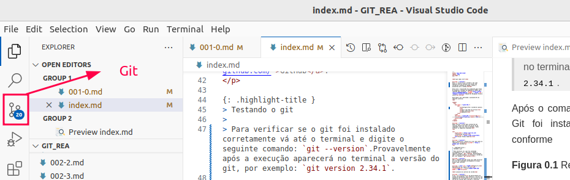

# Instalando o GitHub no VSCode

É possível acessar o GitHub diretamente a partir do IDE. Em particular, serão mostrados os passos necessários para configurar o GitHub no VSCode.

1- Instalar o Visual Studio Code no Windows: [https://code.visualstudio.com/](https://code.visualstudio.com/)

2- Clique em Download for Windows ou macOS.

3- Execute o instalador.

4- No Windows, marque a opção "Add to PATH" e "Register Code as editor".

5- Após instalar, abra o VSCode.

6- Vá até a aba de extensões (ícone de quadrado no menu lateral esquerdo ou Ctrl+Shift+X)

7- Procure por GitHub e instale: GitHub Pull Requests and Issues (oficial da Microsoft)

8- Opcional: GitLens (melhora a visualização do histórico Git)


Ao usar o Git pela primeira vez no VSCode:

1- Abra o terminal do VSCode (Ctrl+\`\` ou Terminal > New Terminal\`)

2- Tente um comando Git, por exemplo: git clone [https://github.com/seu-usuario/seu-repo.git](https://github.com/seu-usuario/seu-repo.git)

3- Se for sua primeira vez, o VSCode vai abrir uma janela solicitando que você faça login com sua conta GitHub

4- Autorize o VSCode a acessar seu GitHub

Concluído as etapas descritas anteriormente, pode-se verificar se o Git foi instalado corretamente no Visual Studio Code conforme a Figura 2. Caso o símbolo de árvore de arquivos esteja presente, a instalação foi bem sucedida.

<figure><figcaption><p>Figura 2: Instalando Git no VSCode</p></figcaption></figure>

Assim, a integração ativa é possível ver branches, commits e diffs no painel Source Control (ícone de ramificação), fazer commits, pull, push, tudo pelo VSCode. Além disso, pode-se criar e revisar pull requests (com a extensão GitHub), resolver conflitos visuais entre branches e por fim, visualizar quem alterou cada linha de código (com GitLens).

Considere o seguinte exdemplo:  Você  clonou um repositório do GitHub para o Git local por meio do seguinte comando no terminal do computador:

```
git clone https://github.com/seu-usuario/meu-projeto.git code meu-projeto
```

Ao final, você verá o projeto aberto no VSCode com suporte Git completo.


O comando _**clone**_ será explicado em detalhes nas próximas seções.

