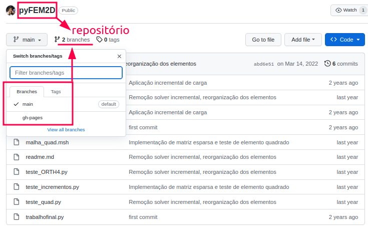
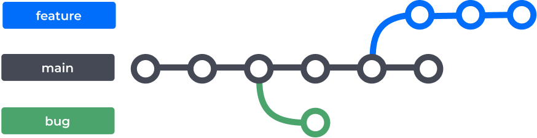
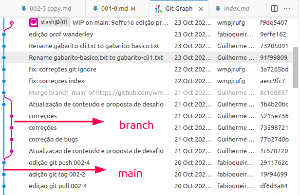
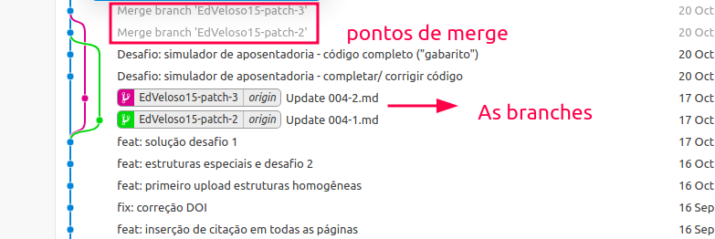

# Criando Branches

Um conceito muito importante no âmbito do Git são os repositórios e ramificações (em inglês _branchs_ e nome mais usado). Um repositório, em um contexto geral, é um local onde algo é armazenado, organizado e mantido. O termo pode ser aplicado a diversas áreas, mas é frequentemente usado na área de tecnologia da informação e desenvolvimento de _software_.\
\
Já as _branchs_ são caminhos separados de desenvolvimento que permitem que você trabalhe em diferentes recursos, correções de bugs ou melhorias de forma independente, sem interferir no código principal. Cada branch representa uma linha de desenvolvimento separada com sua própria cópia do código-fonte e histórico de alterações.\
\
A Figura 3 indica uma busca simples no Google pela palavra chave Repositórios Git de Método dos Elementos Finitos. Nessa busca possível verificar repositórios de usuários que tem como foco a vertente Elementos Finitos.

<figure><figcaption><p>Figura 3: Representação dos repositórios no GitHub.</p></figcaption></figure>

<figure><figcaption><p>Figura 4: Localização das <em>branchs</em> em um repositório.</p></figcaption></figure>

<figure><figcaption><p>Figura 5: Representação de <em>branchs</em> em relação a master.</p></figcaption></figure>


> bug e feture são denominações comuns em ambientes de desenvolvimento. Bug é normalmente para designar um erro no algoriitmo e normalmente uma _branch_ com esse nome é criada justamente para tratar da solução. Já a _feature_ é o nome dado a uma nova funcionalidade que deseja-se implementar no algoritmo.

A extensão git graph instalada nos ajuda a visualizar essas mudanças na linha do tempo do projeto. Vejamos na Figura 6, a representação da criação de uma _branch_ que foi criada no dia 20/10 e finalizada no dia 21/10.

<figure><figcaption><p>Figura 6: Linha do tempo das <em>branches</em> do projeto.</p></figcaption></figure>

Para visualizar as branchs do projeto execute o comando a seguir:

```
$ git branch
```

> A marcação `*` indicará qual _branch_ você está posicionado quando o output do comando aparecer na interface do terminal.

**Exemplo:** Vamos supor que desejamos listar todas as branches de um repositório remoto. Como poderiamos ver isso?&#x20;

```
$ git branch -a
```

```
* main
  remotes/origin/HEAD -> origin/main
  remotes/origin/dependabot/bundler/just-the-docs-0.6.2
  remotes/origin/main
```

**Exemplo 2:** Como eu posso movimentar entre as branches de um projeto?

```
$ git checkout <nome da branch>
```

> Isto muda a _branch_ atual para a _branch_ `nome da branch`.

#### Atualizando a Master

Após fazer as operações em uma _branch_ é comum juntar as modificações realizadas de uma determinada _branch_ para a _branch_ `master`. Para isso é necessário fazer um `merge`. A Figura 7 apresenta o ponto em que as _branches_ foram unificadas a linha do tempo principal.

<figure><figcaption><p>Figura 7: Representação do merge das branches.</p></figcaption></figure>

Para juntar duas _branches_ é necessário estar na _branch_ que deseja-se efetivar as modificações, exemplo: Se eu estou na _branch_ joao e desejo promover modificações na _branch_ main eu preciso exeutar a seguinte sequência.

```
# Fazer todos os commits necessários em joao
$ git checkout main 
$ git branch # verifica se de fato você está na main
$ git merge joao
$ git push origin main
$ git branch -d joao # exclui a branch localmente
$ git push origin --delete joao # exclui a branch remotamente
```

> As sintaxes `git branch -d` e `git push origin --delete` são executadas ao final do `merge` quando a _branch_ não é mais necessário. Logo isso é uma boa prática de manutenção da organização do repositório.


> Sempre quando for realizar um `merge` verifique se a ramificação receptora e a ramificação que vai ser mesclada estão atualizadas com as alterações remotas mais recentes. Isso requer que você faça um `git pull` nessas ramificações.


## Outras maneiras de atualizar a master

Existem outras maneiras de atualizar a _branch_ principal de um projeto. Basicamente a diferença está em como enxergamos a linha de temporal do projeto. No `git merge` as modificações são colocadas na linha temporal como _commits_.\
\
A outra possibilidade é o uso do `git rebase` que permitirá que você mova as suas modificações para principal temporal do projeto. Em suma comparando as modificações temos o seguinte formato:

```
# antes do merge
   feat --C--D--J---    
          /         \
main --A--B---------merge

# depois do merge
   feat --C--D--J---    
          /         \
main --A--B---------merge--H--I--Y

# antes do rebase
   feat --C--D--J---    
          /         
main --A--B----------

# depois do rebase   
main --A--B----------C--D--J---
```

A sintaxe seria similar a do merge porém com a troca de `merge` por `rebase`. Considere o seguinte exemplo:

```
# Fazer todos os commits necessários em joao
$ git checkout main 
$ git branch # verifica se de fato você está na main
$ git rebase joao
$ git push origin main
$ git branch -d joao # exclui a branch localmente
$ git push origin --delete joao # exclui a branch remotamente
```


## Criar uma branch para sua tarefa

Para desempenhar um nova tarefa no repositório,  por exemplo criar uma nova funcionalidade, pode-se opcionalmente usar o comando chekout:

```
git checkout -b feature/login
```

## Enviar sua branch para o repositório remoto

```
git push origin feature/login
```

## Redefinir o branch local para o estado do branch remoto (forçar atualização)

Isso vai descartar todas as mudanças locais e deixar seu branch idêntico ao remoto.

```
git fetch origin
git reset --hard origin/nome-do-branch
```

Exemplo (para o branch main):

```
git fetch origin
git reset --hard origin/main
```

## Redefinir branch para um commit específico

Se quiser voltar para um commit específico (por hash):

```
git reset --hard <hash-do-commit>

```

## Revertendo arquivos específicos para a versão remota

Se quiser só um arquivo voltar para a versão do remoto:

```
git checkout origin/nome-do-branch -- caminho/do/arquivo.ext
```

O comando reset --hard apaga todas as alterações locais sem chance de recuperação (a menos que você saiba usar reflog). Sempre confirme que não vai perder algo importante.

## Deletar uma branch localmente (no seu computador)

No terminal, dentro da pasta do seu repositório execute o seguinte comando:

```
git branch -d nome-da-branch
```

Use -d para deletar uma branch que já foi mergeada.\
Se quiser forçar a deleção mesmo que não tenha sido mergeada, use:

```
git branch -D nome-da-branch
```

## Deletar uma branch no GitHub (remotamente)

Para esta operação, podemos usar o comando git:

```
git push origin --delete nome-da-branch
```

## Deletar via interface web do GitHub

Para deletar uma branch via interface grafica, desempenhe os seguintes passos:

1. Vá no repositório no GitHub.
2. Clique em Branches (geralmente perto da aba Code).
3. Encontre a branch que quer deletar.
4. Clique no ícone da lixeira (🗑️) ao lado da branch para removê-la.\


**Importante:**

* &#x20;Não é possível deletar a branch que está atualmente ativa no seu repositório local.
* Cuidado para não deletar branches importantes!

## Como unir branches no GitHub usando Pull Request

Para unir uma branch via interface grafica, desempenhe os seguintes passos:

1. Crie um branch com suas alterações: Normalmente  cria-se um branch para uma nova funcionalidade ou correção, faz commits e envia para o GitHub.
2. Vá para o repositório no GitHub
3. Clique em Pull requests (aba)
4. Clique em New pull request
5. Escolha o branch base (onde vai receber as mudanças): Exemplo: main (branch que vai receber)
6. &#x20;Escolha o branch comparado (onde estão as mudanças): Exemplo: feature
7. Revise as alterações que serão unidas: Você verá os arquivos que mudaram, commits, etc.
8. Escreva um título e descrição do Pull Request
9. &#x20;Clique em Create pull request
10. Revisão e merge: Agora você (ou outra pessoa) pode revisar o código, comentar e aprovar.

Depois que estiver tudo ok, clique em Merge pull request para unir as branches.

11. &#x20;Apagar o branch (opcional): Após o merge, o GitHub oferece a opção de apagar o branch de feature que foi unido.
