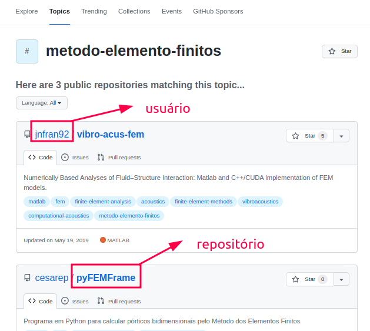

# Criando o primeiro repositório no GitHub

O primeiro passo para começarmos a trabalhar com a ferramenta é a criação de um repositório, que servirá para armazenar projetos que serão controlados pelo GitHub. Para inicializar um repositório vamos usar os seguinte passos:

* Vá para [https://github.com](https://github.com)
* Clique em "New repository"
* Preencha:
  * Nome: exemplo: meu-projeto
  * Opções: deixe como público ou privado
  * Desmarque a opção “_Initialize with a README_” (se já tiver projeto local)
  * Clique em _Create repository_

Após isso, o GitHub mostrará comandos para conectar seu repositório local.

Na Figura 6, é mostrado o repositorio de software após a sua inicialização. É possível observar que após a criação do repositório, este é visuado no seguinte formato: nomedousuário/repositório

<figure><figcaption><p>Figura 6: Criando um repositório no GitHub</p></figcaption></figure>

Para inicializar o Git no seu projeto local,  abra o terminal de comandos do computador e insira os seguintes comandos:

```
cd caminho/do/seu-projeto      # Vá para a pasta do seu projeto
git init                       # Inicia o Git no projeto
git add .                      # Adiciona todos os arquivos
git commit -m "primeiro commit" # Faz o commit inicial
```

Em seguida, para se conectar ao repositório do GitHub copie a URL do seu repositório do GitHub, como: [https://github.com/seu-usuario/meu-projeto.git](https://github.com/seu-usuario/meu-projeto.git) em seguida, no terminal:

```
git remote add origin https://github.com/seu-usuario/meu-projeto.git
git branch -M main                    # (renomeia para branch main, se necessário)
git push -u origin main              # Envia o projeto para o GitHub
```

Em sequência, vá até o repositório no GitHub e nele será possível encontrar todos os arquivos. Para inserir um _**commit**_ ou seja, alterar os arquivos do projeto e adicionar comentarios/mensagens referentes a atualização dos mesmos, pode ser feito da seguinte forma:

```
git add .
git commit -m "alteração importante"
git push
```

Feito isso, nosso repositório já está criado. Assim, tem-se  a versão local do projeto com Git, que por sua vez, também está conectado ao GitHub contendo histórico de código salvo online. Mas, precisamos criar conteúdo para alimentá-lo e posteriormente publicar essas alterações no repositório remoto.
